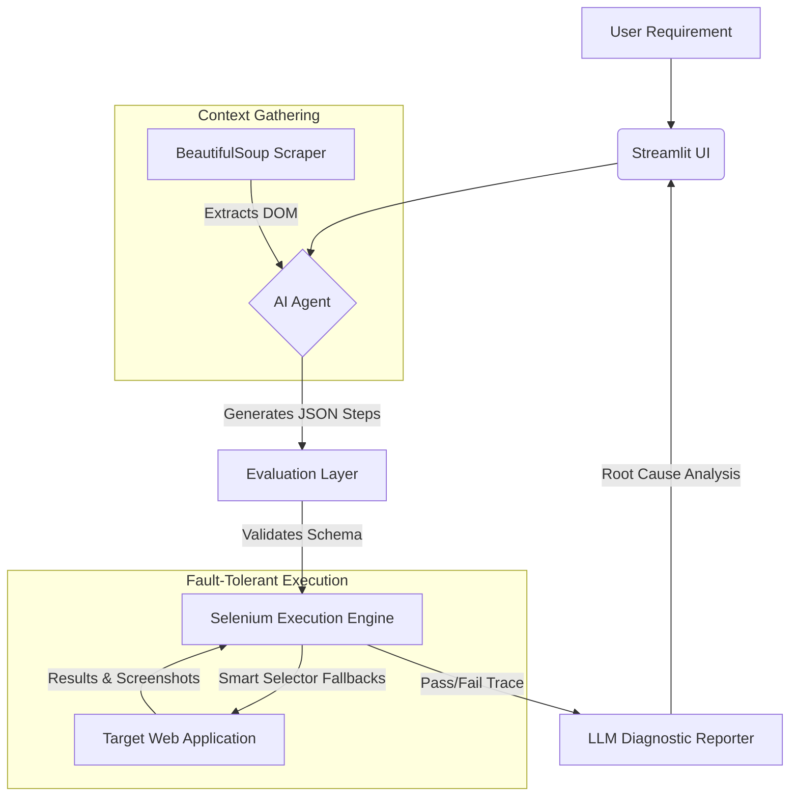

# 🤖 AutoQA: AI-Driven End-to-End Test Automation Framework


AutoQA is an intelligent, agentic UI testing orchestrator that dynamically translates **natural language software requirements** into robust, executable Selenium test scripts. 

By leveraging **DOM context injection** and a **fault-tolerant execution engine**, the framework is designed to reduce test flakiness and manual selector maintenance, bringing autonomous capabilities to QA engineering.

---

## ✨ Engineering Highlights

- 🧠 **Context-Aware DOM Parsing:** Utilizes BeautifulSoup to scrape the target webpage in real-time, extracting interactive elements (forms, inputs, buttons) and injecting them into the LLM context to prevent selector hallucinations.
- 🔁 **Multi-Provider LLM Orchestration:** Built with a resilient, provider-agnostic abstraction layer. Automatically cascades through **Google Gemini (with key rotation) → Mistral AI → Groq** if quotas are exceeded or APIs fail, ensuring continuous operation.
- 🎨 **Cinematic WebGL-Inspired UI:** Features a premium, hardware-accelerated dark mode interface with glassmorphism, animated ambient gradient lighting, and real-time orchestration telemetry—achieved entirely without heavy JS dependencies.
- 🛡️ **Fault-Tolerant Execution:** The Selenium runner implements a smart fallback strategy (`find_element_smart`). If the primary selector fails, it automatically degrades through alternative locators (ID -> Name -> CSS -> Tag), ensuring test stability against dynamic UI changes.
- 🔒 **Input Validation Guardrails:** Enforces a strict validation layer to verify the AI-generated JSON payload before execution, securing the framework against invalid or rogue commands.
- 🩺 **Self-Diagnostic Reporting:** In the event of a test failure, the framework captures the error trace and feeds it back to the LLM to generate a human-readable root-cause analysis, accelerating debugging.

---

## 🏗️ Architecture & Workflow



---

## 📂 Repository Structure

```text
.
├── .github/workflows/       # CI/CD pipelines
├── ai_agent.py              # LLM integration, DOM parsing, and JSON step generation
├── selenium_runner.py       # Core execution engine with smart selector fallbacks
├── evaluation_layer.py      # Guardrails for validating AI JSON output
├── app.py                   # Streamlit user interface
├── notifier.py              # System notifications module
├── serve_test_sites.py      # Local test environment server
├── test_websites/           # Static HTML files for local testing
├── screenshots/             # Auto-generated test evidence (Pass/Fail)
├── Dockerfile               # Containerization instructions
├── requirements.txt         # Project dependencies
└── README.md                # Project documentation
```

---

## 🚀 Setup & Installation

### Prerequisites
- Python 3.9+ (or Docker)
- Google Chrome & ChromeDriver (if running locally)
- A Google Gemini API Key

### Environment Variables
AutoQA supports **Multi-Provider LLM Orchestration**. If your primary key exhausts its quota or encounters a temporary failure, the system seamlessly cascades to the next available provider without crashing the UI.

Create a `.env` file (or copy from `.env.example`) in the root directory:
```env
# --- PRIMARY PROVIDER ---
GEMINI_API_KEY=your_google_gemini_api_key

# Optional Gemini Key Rotation
GEMINI_API_KEY_1=your_backup_gemini_key_1
GEMINI_API_KEY_2=your_backup_gemini_key_2

# --- FALLBACK PROVIDERS (Optional) ---
MISTRAL_API_KEY=your_mistral_key_here
GROQ_API_KEY=your_groq_key_here
```
*Note: If an optional provider's key is missing, the orchestrator will safely skip it.*

### Option A: Local Installation
1. **Clone the repository:**
   ```bash
   git clone https://github.com/mahirdesai2004/agentic-qa-engineer.git
   cd agentic-qa-engineer
   ```
2. **Install Dependencies:**
   ```bash
   pip install -r requirements.txt
   ```
3. **(Optional) Start the Local Test Server:**
   ```bash
   python serve_test_sites.py
   ```
4. **Launch the Application:**
   ```bash
   streamlit run app.py
   ```

### Option B: Docker Deployment 🐳
AutoQA is fully containerized with its own headless browser environment.
```bash
# Build the image
docker build -t autoqa .

# Run the container (pass your .env file)
docker run -p 8501:8501 --env-file .env autoqa
```
Access the app at `http://localhost:8501`.

---

## 📸 Execution Demo

| PASS (Successful Navigation) | FAIL (Self-Diagnosed Error) |
|------|------|
|  |  |

---

## 🛠️ Troubleshooting & Future Improvements

**Common Issues:**
- **Timeout Exceptions:** Ensure your internet connection is stable, as the AI needs to reach the Gemini API.
- **Browser Not Found:** If running locally (without Docker), ensure Google Chrome and ChromeDriver are installed and in your PATH.

**Future Scope:**
- Integration with cloud browser providers (BrowserStack, Sauce Labs).
- Parallel execution capabilities for massive test suites.
- Export test results to formal JUnit XML for broader CI integrations.

---

## 🤝 Contributing
Contributions, issues, and feature requests are welcome. Feel free to check the [issues page](../../issues).

## 👨‍💻 Author
**Mahir Desai**
